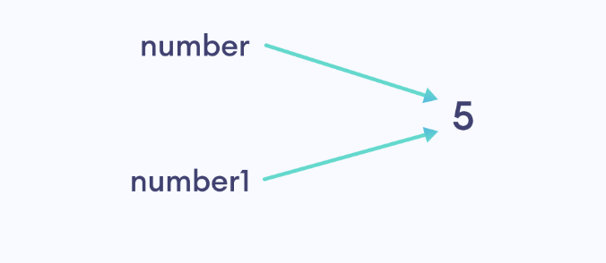

# Python Beyond Basic

## List 進階寫法，結合 Loop

```python
numbers = [2**i for i in range(1, 6)]
print(numbers)


# Output
#[2, 4, 8, 16, 32]
```

加上 if，前面的 n for n in numbers 可以複製已命名的 list。

```
numbers = [12, 15, 21, 32, 14]

even_numbers = [n for n in numbers if n % 2 == 0]


print(even_numbers)    # [12, 32, 14]
```

創造一個 1 到 n 的 list

```python
# get an integer input
n = int(input())

# create a list using list comprehension
numbers = [ i for i in range(1, n+1)]

# print the list
print(numbers)
```


Dictionary 的簡易寫法

一開始學的寫法

```python
numbers = [1, 2, 3, 4]

# creating an empty dictionary

square_numbers = {}

# using a loop to add items to dictionary
for number in numbers:
  square_numbers[number] = number**2
 
print(square_numbers)


```

進階的寫法

```python
numbers = [1, 2, 3, 4]

square_numbers {number: number**2 for number in numbers }

print(square_numbers)


```

.png>)

還可以加上 condition

```python
numbers = [1,2,3,4]

# create dictionary using comprehension
square_numbers = {number:number**2 for number in numbers if numbrt > 2}
 
print(square_numbers)   # {3: 9, 4: 16}

```

練習題，用戶可以輸入一個整數，寫一個 dictionary 他的 key value 是 1 比 10 的關係，


```python

# get integer input
n = int(input())

# create the dictionary using comprehension
numbers = {number:number*10 for number in range(1,n+1) if number >= 3}

print(numbers) # {3: 30, 4: 40}

```

## Lambda Function

Lambda functions 跟一般 function 不同的地方：

* lambda function 沒有名稱或匿名
* lambda function 的 body 只有一行 expression

在學習 lambda function 之前，我們先看一般  function，再看一樣的 function 怎麼用lambda function 改寫。

```python
def double(n):
    return n*2
 
print(double(10))    # 20

```

這邊的`double()` function 有一個 argument 並回傳兩倍的值。現在我們用 lambda function 改寫。

```python
double = lambda n: n*2
print(double(10))
```

我們用 `lambda` 當作關鍵字去定義 lambda function，在 `:` 之前是我們接收的argument ，在冒號 `:` 之後是回傳值。

 (2).png>)

以程式來看，我們把 lambda function  assigned 到 `double` 這個變數裡，我們 call 這個lambda function透過 `double(value)`的寫法。

我們可以放不只一個 argument 在 lambda function 裡，可以放多個 argument 用逗號分開，我們來看案例：

```python
# program to find the product of two numbers
product = lambda x, y: x*y
 
result = product(5, 10)
print(result)   # 50
```


## **Positional arguments**

依照下面案例依順序在 display\_info 放 `name` parameter 和 `age` parameter，我們稱作 positional arguments。

```python
def display_info(name, age):
    print(name)
    print(age)
 
display_info('Amanda', 22)

```

## Keyword Arguments

keyword arguments 裡 arguments 都根據名稱來 assign。我要 function 內的 name argument assign 什麼值，我要 assign age argument 什麼值，可以不依照順序。

```python
def display_info(name, age):
    print(f'name = {name}')
    print(f'age = {age}')
 
display_info(age = '22', name = 'Amanda')

```

 (2).png>)

## Default Arguments

我們可以提供預設值給 argument，像下面的案例原本是 error，因為我們沒有傳任何 argument：

```python
def greet(message):
    print(message)
 
greet()

```

一個解決方案是設定預設值：

```python
def greet(message = 'Howdy'):
    print(message)
 
greet()
```

## Default Arguments in print()

&#x20;`print()` function 裡有個預設的 argument 是空格，像下面這個印出來會有空格：

```python
print('Hello','there')

#Hello there
```

這個 default argument 叫做 `sep` 代表 separator， `sep` 的預設值是 `' '`。我們可以改動 `sep` argument 的預設值

```python
print('Hello', 'there', sep = '###')

#Hello###there
```


## **Variable Argument**

在 call function 的時候要根據 argument 數量，例如有下面的案例。我們只有一個 message argument，但我們放了 2 個 argument 就會出現 error。

```python
def greet(message):
    print(message)

greet('Hi', 'Hello')

#TypeError: greet() takes 1 positional argument but 2 were given
```

除了把 argument 變成 2 個外，還有 variable argument 的方法，我們在 argument 前加個星號。這個 argument 除了變成 variable argument 外也會是個 tuple，如果你沒輸入就會變成 empty tuple。

```python
def greet(*messages):
    print(messages)
 
# calling greet() with 1 argument
greet('Hi')
 
# calling greet() with 2 arguments
greet('Hi', 'Hello')
 
# calling greet() without any arguments
greet()
```

像下面這個案例就很方便，numbers 可以隨你想放幾個 argument 把他們做加總。

```python
def add_numbers(*numbers):
    
    # calculate sum of tuple items
    total = 0
    for number in numbers:
        total = total + number;
        
    return total
 
# call add_numbers with two arguments
result = add_numbers(5, 10)
print(result)    # 15
 
# call add_numbers with three arguments
result = add_numbers(5, 10, 20)
print(result)    # 35

```


## \*\*kwargs

kw 是 keyword，arg 是 argument。當然也可以一次傳多個 keyword argument，只要我們在 argument 前加兩個星星 `**` 。

```python
def print_info(**person):
    print(person)

print_info()
print_info(name = 'Steve')
print_info(name = 'Steve', age = 22)


#{}
#{'name': 'Steve'}
#{'name': 'Steve', 'age': 22}
```

裡面的 keyword argument 可以一直加，印出來是一個  dictionary，dictionary 的 key 是你輸入的 argument 名稱，value 會是 argument 的 value，看下面的案例比較清楚：

* the key will be the argument name
* the key's value will be the value of the argument

```python
# make the function take a variable number of keyword arguments
def greet(**number):
    # print the argument
    print(number)

formal = input()
informal = input()
greet(formal = formal, informal = informal)

#Test Input
#Hello
#Howdy

#Output
#{'formal': 'Hello', 'informal': 'Howdy'}
```


## Recursion

據我們所知，我們呼叫 function 並使用它們，但其實可以從 function 的 body 內呼叫 function 自己。遞迴 function 就是 function 自己叫自己。Recursion 遞迴不是  Python native，其他程式也有遞迴的概念，我們從下面的案例開始說明：

<pre class="language-python"><code class="lang-python">def print_variable():
    text = 'Hello'
    print(text)
  
    # call print_variable() inside the same function
    print_variable()

print_variable()

#Output
<strong>#Hello
</strong>#Hello
#Hello
#... .. ...
</code></pre>

運作的概念上，在

 (3).png>)

我們在  `print_variable()` function 內呼叫 `print_variable()` function 他自己，因此會不斷循環，這是一個無限 recursion 的案例，有幾件事情我們需要知道。

1. 雖然我們一直在 call `print_variable()` function，但這些 functions 其實不同。
2. 因為在 function 內的 variable 是 local variable， `text` variable 在每個 `print_variable()` function 內都是 local 的。

.png>)

## Object-oriented Programming (OOP)

Object-oriented programming (OOP) 藉由建立物件解決程式問題，是很受歡迎的技術。

我們透過下面的案例來了解，假設我們要儲存大學生的名字和分數資料，基於考試的分數來判斷有沒有通過考試，程式的架構如下：

 (4).png>)

想像我們要儲存的學生和分數不只一位而是很多位，這樣要一位一位儲存，會讓程式很雜亂。

.png>)

由於這些資料和 function 有關聯性，最好是把他們當成 single entity，我們可以透過物件導向來解決這個問題。接下來我們用物件來解決這個這個問題：


### Classes and Objects

建立物件有 2 個步驟：

1. 定義 class
2. 從定義中創造物件

### Define a Class

To solve the problem mentioned in the last page, we will first define a class named **Student**.

```python
# create a class
class Student:
    pass
```



This **Student** class has two variables `name` and `score`, and a function `check_pass_fail()`.

One thing to remember about classes is that they cannot store data. We can store data after we create objects from the class

**Think of a class as a blueprint of a house. It contains all the details about the floors, doors, windows etc. Based on these descriptions we build the house. The actual physical house is the object.**

Now, let's see the part of creating objects.


### Creating Objects

Once we define a class, we can create as many objects as we want from the class.


.png>)

```python
# create a class
class Student:
    pass

# outside the class
# create objects of Student
student1 = Student()
student2 = Student()
```

上面是我們如何用 class 建立物件， `student1` 和 `student2` 都是`Student` class 的物件。然後 data 是存在 object 裡，不是存在 class。


All the objects of this `Student` class will have the `name` variable and the `score` variable, and can use the `check_pass_fail()` function.


## Attributes and Methods


在定義 classes 和物件的時候

* **variables** 稱作 **attributes**
* **functions** 稱作 **methods**

當我們在談論物件導向，我們會用 attribute 和 method 這些專有名詞。


### Adding Attributes

下面是手動增加 attributes 到物件的寫法：

```python
class Student:
    pass
 
# create objects
student1 = Student()
 
# add attributes
student1.name = 'Harry'
student1.score = 85
 
# print attributes of student1
print(student1.name)
print(student1.score)
```

在這裡 `student1.name = 'Harry'` 是把 name attribute 加進 `student1` object。同樣 `student1.score` 把 `score` attribute 加進 object。

但這不是最好的方法，下面會再介紹。

## Adding Methods

如同我們先前提到的，在物件導向的世界 methods 是指 function，下面我們一樣用 `Student` class 的案例做示範：

```python
class Student:
 
    # add a method to check pass/fail
    def check_pass_fail(self):
        if self.score >= 40:
            return True
        else:
            return False
 
# create objects
student1 = Student()
 
# add attributes
student1.name = 'Harry'
student1.score = 85
```

這邊我們在 Student class 內寫了 `check_pass_fail()` 這個 method，現在任何由student class 創造的物件都可以用這個 method。

第一個要注意當我們在定義 methods，我們一定要用 `self` 當第一個 argument，因為我們會用物件呼叫 method，像`student1.check_pass_fail()`裡的 `student1` object 會自動傳 `check_pass_fail()` method，  `self` argument 代表 object。


When we define methods, we must use `self` as the first argument. It's because we are calling the method using the object, `student1.check_pass_fail()`. This `student1` object is automatically passed to the `check_pass_fail()` method and the `self` argument will be this object.


**Remember:** We must always use `self` as the first argument in the function definition. This `self` takes the value of the object calling it.



第二個，在 `check_pass_fail()` method 內的 `self.score`會怎麼運作呢？

因為 `self` 在 `check_pass_fail()` method 裡代表 `student1` object 這個值， `self.score` 等於  `student1.score` 在這個案例是 85，這就是為何程式可以運作而沒有 error。從下面的說明來看比較清楚：

.png>)

### Adding Attributes in a Proper Way

Python 提供很多種更好的方式去定義 attribute 當我們創建 object 的時候，這邊是透過 `__init__()` method。

這個 `__init__()` method 是當 object 建立時會自動呼叫的 special method，我們來看例子：

```python
class Test:
    def __init__(self):
        print('Hello there')
 
test1 = Test()
test2 = Test()


#Output
#Hello there
#Hello there
```

程式的運作上，當建立 `test1` object 的時候， `__init__()` method 會被呼叫， `__init__()` method 內的 self argument 拿 `test1` object 當作值，test2 object 建立的時候也是一樣。

接著我們把 attributes 加進 init method

```python
class Student:
 
    # adding the __init__() method
    def __init__(self, name, score):
       self.name = name
       self.score = score
 
    # add a method to check pass/fail
    def check_pass_fail(self):
        if self.score >= 40:
            return True
        else:
            return False
 
# create object
student1 = Student('Harry', 85)
 
# calling this method using student1
did_pass = student1.check_pass_fail()
print(f'Did {student1.name} pass?', did_pass)


#Ouput
#Did Harry pass? True

```

在上面的程式中，當我們創建 object 的時候，會自動呼叫 `__init__()` method，在 method 內：

* `self` 會拿  `student1`物件作為值
* &#x20;`name` argument 會是 `'Harry'`
* &#x20;`score` argument 會是 `85`

然後 `name` 會存在 `self.name`，因為 name 代表 `object1` ，物件1 的 name argument 會是 `'Harry'`

\


.png>)

假如你要新增 attributes 到物件裡，記得用 `__init__()` method，在 init method 內assign 數值到`self.name`


## Using Objects as Arguments

objects `是可以當成` argument 放入  method 內，請看下面案例：

<pre class="language-python"><code class="lang-python">class Person:
    def __init__(self, name, age):
        self.name = name
        self.age = age
 
    def print_person_attributes(self, person):
        print(self.name)    # Ana
        print(self.age)     # 21
        print(person.name)    # Sara
        print(person.age)    # 20
 
# create an object
person1 = Person('Ana', 21)
 
# create another object
person2 = Person('Sara', 20)
 
# calling print_persons_attributes() using person1 object
# person2 is used as an argument
person1.print_person_attributes(person2)

#Output
#Ana
<strong>#21
</strong>#Sara
#20</code></pre>


* 在 `print_persons_attributes()`裡的`self` 是 `person1` ，因為我們呼叫時候的 object 是用 `person1`，然而  `person` argument 我們是用`person2`當作 argument 放進去。
* 因此當我們print `self.name` 和 `self.age`, ，我們獲得的 attributes 變數是 `person1`的，當我們印 `person.name` 和 `person.age`，我們獲得的 attributes 是 `person2的。`

`圖解是這樣：`

.png>)

``
