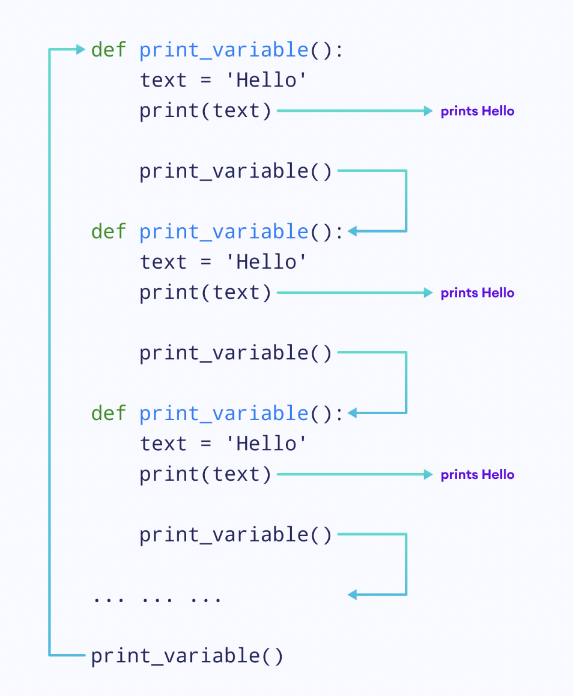

# Python Beyond Basic

## List 進階寫法，結合 Loop

```python
numbers = [2**i for i in range(1, 6)]
print(numbers)


# Output
#[2, 4, 8, 16, 32]
```

加上 if，前面的 n for n in numbers 可以複製已命名的 list。

```
numbers = [12, 15, 21, 32, 14]

even_numbers = [n for n in numbers if n % 2 == 0]


print(even_numbers)    # [12, 32, 14]
```

創造一個 1 到 n 的 list

```python
# get an integer input
n = int(input())

# create a list using list comprehension
numbers = [ i for i in range(1, n+1)]

# print the list
print(numbers)
```


## Dictionary 的簡易寫法 <a href="#if-statements" id="if-statements"></a>

一開始學的寫法

```python
numbers = [1, 2, 3, 4]

# creating an empty dictionary

square_numbers = {}

# using a loop to add items to dictionary
for number in numbers:
  square_numbers[number] = number**2
 
print(square_numbers)


```

進階的寫法

```python
numbers = [1, 2, 3, 4]

square_numbers = {number: number**2 for number in numbers }

print(square_numbers)


```

 (1).png>)

還可以加上 condition

```python
numbers = [1,2,3,4]

# create dictionary using comprehension
square_numbers = {number:number**2 for number in numbers if numbet > 2}
 
print(square_numbers)   # {3: 9, 4: 16}

```

練習題，用戶可以輸入一個整數，寫一個 dictionary 他的 key value 是 1 比 10 的關係，


```python

# get integer input
n = int(input())

# create the dictionary using comprehension
numbers = {number:number*10 for number in range(1,n+1) if number >= 3}

print(numbers) # {3: 30, 4: 40}

```

## Lambda Function

Lambda functions 跟一般 function 不同的地方：

* lambda function 沒有名稱或匿名
* lambda function 的 body 只有一行 expression

在學習 lambda function 之前，我們先看一般  function，再看一樣的 function 怎麼用lambda function 改寫。

```python
def double(n):
    return n*2
 
print(double(10))    # 20

```

這邊的`double()` function 有一個 argument 並回傳兩倍的值。現在我們用 lambda function 改寫。

```python
double = lambda n: n*2
print(double(10))
```

我們用 `lambda` 當作關鍵字去定義 lambda function，在 `:` 之前是我們接收的argument ，在冒號 `:` 之後是回傳值。

 (2).png>)

以程式來看，我們把 lambda function  assigned 到 `double` 這個變數裡，我們 call 這個lambda function透過 `double(value)`的寫法。

我們可以放不只一個 argument 在 lambda function 裡，可以放多個 argument 用逗號分開，我們來看案例：

```python
# program to find the product of two numbers
product = lambda x, y: x*y
 
result = product(5, 10)
print(result)   # 50
```


開根號(square roots)

```python
# create the function
compute = lambda x,y:x**0.5 + y**0.5

# take two integer inputs
n1 = int(input())
n2 = int(input())

# call the function and print the result
result = compute(n1,n2)
print(result)
```


## **Positional arguments**

依照下面案例依順序在 display\_info 放 `name` parameter 和 `age` parameter，我們稱作 positional arguments。

```python
def display_info(name, age):
    print(name)
    print(age)
 
display_info('Amanda', 22)

```

## Keyword Arguments

keyword arguments 裡 arguments 都根據名稱來 assign。我要 function 內的 name argument assign 什麼值，我要 assign age argument 什麼值，可以不依照順序。

```python
def display_info(name, age):
    print(f'name = {name}')
    print(f'age = {age}')
 
display_info(age = '22', name = 'Amanda')

```

 (2).png>)

## Default Arguments

我們可以提供預設值給 argument，像下面的案例原本是 error，因為我們沒有傳任何 argument：

```python
def greet(message):
    print(message)
 
greet()

```

一個解決方案是設定預設值：

```python
def greet(message = 'Howdy'):
    print(message)
 
greet()
```

另一個案例

```python
def func(n1 = 10,n2 = 100):
    print(n1)
    print(n2)

# take integer input
n = int(input())

# call the function
func(n)

```

## Default Arguments in print()

&#x20;`print()` function 裡有個預設的 argument 是空格，像下面這個印出來會有空格：

```python
print('Hello','there')

#Hello there
```

這個 default argument 叫做 `sep` 代表 separator， `sep` 的預設值是 `' '`。我們可以改動 `sep` argument 的預設值

```python
print('Hello', 'there', sep = '###')

#Hello###there
```


## **Variable Argument**

在 call function 的時候要根據 argument 數量，例如有下面的案例。我們只有一個 message argument，但我們放了 2 個 argument 就會出現 error。

```python
def greet(message):
    print(message)

greet('Hi', 'Hello')

#TypeError: greet() takes 1 positional argument but 2 were given
```

除了把 argument 變成 2 個外，還有 variable argument 的方法，我們在 argument 前加個星號。這個 argument 除了變成 variable argument 外也會是個 tuple，如果你沒輸入就會變成 empty tuple。

```python
def greet(*messages):
    print(messages)
 
# calling greet() with 1 argument
greet('Hi')
 
# calling greet() with 2 arguments
greet('Hi', 'Hello')
 
# calling greet() without any arguments
greet()
```

像下面這個案例就很方便，numbers 可以隨你想放幾個 argument 把他們做加總。

```python
def add_numbers(*numbers):
    
    # calculate sum of tuple items
    total = 0
    for number in numbers:
        total = total + number
        
    return total
 
# call add_numbers with two arguments
result = add_numbers(5, 10)
print(result)    # 15
 
# call add_numbers with three arguments
result = add_numbers(5, 10, 20)
print(result)    # 35

```


## Variable Keyword Arguments

&#x20;A function can take a variable number of keyword arguments.

\*\*kwargs，kw 是 keyword，arg 是 argument。當然也可以一次傳多個 keyword argument，只要我們在 argument 前加兩個星星 `**` 。

```python
def print_info(**person):
    print(person)

print_info()
print_info(name = 'Steve')
print_info(name = 'Steve', age = 22)


#{}
#{'name': 'Steve'}
#{'name': 'Steve', 'age': 22}
```

裡面的 keyword argument 可以一直加，印出來是一個  dictionary，dictionary 的 key 是你輸入的 argument 名稱，value 會是 argument 的 value，看下面的案例比較清楚：

* the key will be the argument name
* the key's value will be the value of the argument

```python
# make the function take a variable number of keyword arguments
def greet(**number):
    # print the argument
    print(number)

formal = input()
informal = input()
greet(formal = formal, informal = informal)

#Test Input
#Hello
#Howdy

#Output
#{'formal': 'Hello', 'informal': 'Howdy'}
```


## Recursion

據我們所知，我們呼叫 function 並使用它們，但其實可以從 function 的 body 內呼叫 function 自己。遞迴 function 就是 function 自己叫自己。Recursion 遞迴不是  Python native，其他程式也有遞迴的概念，我們從下面的案例開始說明：

<pre class="language-python"><code class="lang-python">def print_variable():
    text = 'Hello'
    print(text)
  
    # call print_variable() inside the same function
    print_variable()

print_variable()

#Output
<strong>#Hello
</strong>#Hello
#Hello
#... .. ...

</code></pre>

運作的概念上，在

 (3).png>)

我們在  `print_variable()` function 內呼叫 `print_variable()` function 他自己，因此會不斷循環，這是一個無限 recursion 的案例，有幾件事情我們需要知道。

1. 雖然我們一直在 call `print_variable()` function，但這些 functions 其實不同。
2. 因為在 function 內的 variable 是 local variable， `text` variable 在每個 `print_variable()` function 內都是 local 的。

 (1).png>)

## Object-oriented Programming (OOP)

Object-oriented programming (OOP) 藉由建立物件解決程式問題，是很受歡迎的技術。

我們透過下面的案例來了解，假設我們要儲存大學生的名字和分數資料，基於考試的分數來判斷有沒有通過考試，程式的架構如下：

 (1).png>)

想像我們要儲存的學生和分數不只一位而是很多位，這樣要一位一位儲存，會讓程式很雜亂。

 (1).png>)

由於這些資料和 function 有關聯性，最好是把他們當成 single entity，我們可以透過物件導向來解決這個問題。接下來我們用物件來解決這個這個問題：


### Classes and Objects

建立物件有 2 個步驟：

1. 定義 class
2. 從定義中創造物件

### Define a Class

To solve the problem mentioned in the last page, we will first define a class named **Student**.

```python
# create a class
class Student:
    pass
```

.png>)

This **Student** class has two variables `name` and `score`, and a function `check_pass_fail()`.

One thing to remember about classes is that they cannot store data. We can store data after we create objects from the class

**Think of a class as a blueprint of a house. It contains all the details about the floors, doors, windows etc. Based on these descriptions we build the house. The actual physical house is the object.**

Now, let's see the part of creating objects.


### Creating Objects

Once we define a class, we can create as many objects as we want from the class.


 (3).png>)

```python
# create a class
class Student:
    pass

# outside the class
# create objects of Student
student1 = Student()
student2 = Student()
```

上面是我們如何用 class 建立物件， `student1` 和 `student2` 都是`Student` class 的物件。然後 data 是存在 object 裡，不是存在 class。要確認 2 個物件有沒有一樣，可以用 id function。


All the objects of this `Student` class will have the `name` variable and the `score` variable, and can use the `check_pass_fail()` function.


## Attributes and Methods


在定義 classes 和物件的時候

* **variables** 稱作 **attributes**
* **functions** 稱作 **methods**

當我們在談論物件導向，我們會用 attribute 和 method 這些專有名詞。


### Adding Attributes

下面是手動增加 attributes 到物件的寫法：

```python
class Student:
    pass
 
# create objects
student1 = Student()
 
# add attributes
student1.name = 'Harry'
student1.score = 85
 
# print attributes of student1
print(student1.name)
print(student1.score)
```

在這裡 `student1.name = 'Harry'` 是把 name attribute 加進 `student1` object。同樣 `student1.score` 把 `score` attribute 加進 object。

但這不是最好的方法，下面會再介紹。


### 座標相加的案例

Coordinate 是座標

```python
# create the Coordinate class
class Coordinate:

    # initialize x and y attributes inside __init__()
    def __init__(self, x, y):
        self.x = x
        self.y = y

    # define the add_coordinates() method
    def add_coordinates(self, coordinate):
        return Coordinate(self.x + coordinate.x, self.y+coordinate.y)

#或是寫成
#Coordinate.x = self.x + coordinate.x
#Coordinate.y = self.y + coordinate.y
#return Coordinate


# create objects c1 and c2
c1 = Coordinate(5,6)
c2 = Coordinate(7,9)

# call the add_coordinates() method
c3 = c1.add_coordinates(c2)

# print attributes of the c3 object
print(c3.x)
print(c3.y)
```

### 三角形周長相加的案例

```python
# create the Triangle class
class Triangle:
    # define the __init__() method
    def __init__(self, x,y,z):
        self.x = x
        self.y = y
        self.z = z

    # define the get_perimeter() method
    def get_perimeter(self):
        return self.x + self.y + self.z
        

# take three integer inputs
a = int(input())
b = int(input())
c = int(input())

# create an object of the Triangle class
tri = Triangle(a,b,c)

# call the get_perimeter() method
perimeter = tri.get_perimeter()

# print the perimeter
print(perimeter)
```

### 練習用物件導向的寫法，將 list 的單一項目加總

下面是將學生考的分數加總

```python

# create the Student class
class Student:

    # use the __init__() method to initialize the scores attribute  
    def __init__(self, scores):
        self.scores = scores
  
    # create the get_scores_sum() method that returns the sum of scores items
    def get_scores_sum(self):
        return sum(self.scores)
  
# create the scores variable
scores = [55, 75, 80, 62, 77]

# create an object of Student by passing scores as an argument
s1 = Student(scores)

# call the get_scores_sum() method using the s1 object
total = s1.get_scores_sum()

# print total
print(total)
```


## Adding Methods

如同我們先前提到的，在物件導向的世界 methods 是指 function，下面我們一樣用 `Student` class 的案例做示範：

```python
class Student:
 
    # add a method to check pass/fail
    def check_pass_fail(self):
        if self.score >= 40:
            return True
        else:
            return False
 
# create objects
student1 = Student()
 
# add attributes
student1.name = 'Harry'
student1.score = 85
```

這邊我們在 Student class 內寫了 `check_pass_fail()` 這個 method，現在任何由student class 創造的物件都可以用這個 method。

第一個要注意當我們在定義 methods，我們一定要用 `self` 當第一個 argument，因為我們會用物件呼叫 method，像`student1.check_pass_fail()`裡的 `student1` object 會自動傳 `check_pass_fail()` method，  `self` argument 代表 object。


When we define methods, we must use `self` as the first argument. It's because we are calling the method using the object, `student1.check_pass_fail()`. This `student1` object is automatically passed to the `check_pass_fail()` method and the `self` argument will be this object.


**Remember:** We must always use `self` as the first argument in the function definition. This `self` takes the value of the object calling it.



第二個，在 `check_pass_fail()` method 內的 `self.score`會怎麼運作呢？

因為 `self` 在 `check_pass_fail()` method 裡代表 `student1` object 這個值， `self.score` 等於  `student1.score` 在這個案例是 85，這就是為何程式可以運作而沒有 error。從下面的說明來看比較清楚：

.png>)

### Adding Attributes in a Proper Way

Python 提供很多種更好的方式去定義 attribute 當我們創建 object 的時候，這邊是透過 `__init__()` method。

這個 `__init__()` method 是當 object 建立時會自動呼叫的 special method，我們來看例子：

```python
class Test:
    def __init__(self):
        print('Hello there')
 
test1 = Test()
test2 = Test()


#Output
#Hello there
#Hello there
```

程式的運作上，當建立 `test1` object 的時候， `__init__()` method 會被呼叫， `__init__()` method 內的 self argument 拿 `test1` object 當作值，test2 object 建立的時候也是一樣。

接著我們把 attributes 加進 init method

```python
class Student:
 
    # adding the __init__() method
    def __init__(self, name, score):
       self.name = name
       self.score = score
 
    # add a method to check pass/fail
    def check_pass_fail(self):
        if self.score >= 40:
            return True
        else:
            return False
 
# create object
student1 = Student('Harry', 85)
 
# calling this method using student1
did_pass = student1.check_pass_fail()
print(f'Did {student1.name} pass?', did_pass)


#Ouput
#Did Harry pass? True

```

在上面的程式中，當我們創建 object 的時候，會自動呼叫 `__init__()` method，在 method 內：

* `self` 會拿  `student1`物件作為值
* &#x20;`name` argument 會是 `'Harry'`
* &#x20;`score` argument 會是 `85`

然後 `name` 會存在 `self.name`，因為 name 代表 `object1` ，物件1 的 name argument 會是 `'Harry'`

\


.png>)

假如你要新增 attributes 到物件裡，記得用 `__init__()` method，在 init method 內assign 數值到`self.name`


## Using Objects as Arguments

objects `是可以當成` argument 放入  method 內，請看下面案例：

<pre class="language-python"><code class="lang-python">class Person:
    def __init__(self, name, age):
        self.name = name
        self.age = age
 
    def print_person_attributes(self, person):
        print(self.name)    # Ana
        print(self.age)     # 21
        print(person.name)    # Sara
        print(person.age)    # 20
 
# create an object
person1 = Person('Ana', 21)
 
# create another object
person2 = Person('Sara', 20)
 
# calling print_persons_attributes() using person1 object
# person2 is used as an argument
person1.print_person_attributes(person2)

#Output
#Ana
<strong>#21
</strong>#Sara
#20
</code></pre>


* 在 `print_persons_attributes()`裡的`self` 是 `person1` ，因為我們呼叫時候的 object 是用 `person1`，然而  `person` argument 我們是用`person2`當作 argument 放進去。
* 因此當我們print `self.name` 和 `self.age`, ，我們獲得的 attributes 變數是 `person1`的，當我們印 `person.name` 和 `person.age`，我們獲得的 attributes 是 `person2的。`

`圖解是這樣：`

 (2).png>)

應用題，交通工具的引擎

```python
# create the Engine class
class Engine:
    # use __init__() to initialize the power attribute 
    def __init__(self,power):
        self.power = power
        

# create the Vehicle class
class Vehicle:
    # use __init__() to initialize the wheels attribute
 
    def __init__(self, wheels):
        self.wheels = wheels
        
        # the engine attribute should be an object of the Engine class with the power attribute 400
        self.engine = Engine.power = 400
    
    # create the get_power() method
    def get_power(self):
        # print the power attribute of the engine attribute (which is an object of Engine) 
        print(self.engine)

# create an object of Vehicle
vehicle = Vehicle(4)

# call the get_power() method using the object
vehicle.get_power()


```

如果你解決的問題很簡單，不要用 object-oriented programming 因為你需要寫很多程式。如果是很複雜的問題參雜很多相關的變數和程式，你可以用物件導向解決，很合理。

Python 已經存在定義的內容都是物件，無論是 strings, lists, numbers 或 functions。

**Everything is an object in Python.**


## How Do Variables Actually Work?

我們假設了下面一段程式：

```
number = 5
```

In our courses, we have been mentioning that this code stores **5** in variable `number`. Technically, it's wrong.

Here, `number` is more like a name tag and it can refer to any object. Currently, it is referring to **5**.


.png>)

Now, if we create another variable `number1` and assign `number` to it, both `number` and `number1` will refer to the same object.




## How Do Variables Actually Work?

這邊要講變數實際上是物件，他的運行概念以下面的 case 做討論。

```python
list1 = [1, 2, 3]
 
# assign list1 to list2
list2 = list1 
 
# append an item to list1
list1.append(4)
 
print(list1)
print(list2)


```

上面的程式中 `list1` 很明顯是 `[1, 2, 3, 4]` 因為我們把 **4** 加進去 `[1, 2, 3]`。比較讓人驚訝的是 `list2` 也是 `[1, 2, 3, 4]`

這是因為我們賦予 `list1` 和 `list2` 等號，他們是一樣的 object，如果我們 check 他們的 id 會發現一樣。

這也是使用 `copy()` method 的原因，複製一個一樣的，但是他們不等於。

```python
list1 = [1, 2, 3]
 
# assign list1 to list2
list2 = list1.copy()
 
list1.append(4)
 
print(list1)    # [1, 2, 3, 4]
print(list2)    # [1, 2, 3]

```

一個物件有什麼 attributes 和 methods 可以用 `dir()` function 列出來。


## Inheritance Introduction

Inheritance 是物件導向蠻重要的概念，假設我們有一個競賽是要比交通工具的速度，因為汽車和摩托車都是交通工具，透過建立 Vehicle class，他們可以共享一些 attributes 和 methods。

&#x20;`Car` class 會繼承所有 attributes 和 methods 從 `Vehicle` 來，我們會新增汽車特有的功能在 `Car` class 裡。同樣的， `Motorcycle` class 也是繼承`Vehicle` class，再另外設定特有的功能。


.png>)

這是繼承的基本概念，繼承讓 class 有母子的概念，這個案例中 `Vehicle` 是 **parent 或稱作 base class** ， `Car` 和 `Motorcycle` 都是 **child 或稱作 derived classes。**

下面的案例中 Animal class，我們 derive 一個叫 `Dog` class。

```python
class Animal:
    def eat(self):
        print("I can eat")

# the Dog class is derived from Animal        
class Dog(Animal):
    def bark(self):
        print("I can bark")

# create an object of Dog
dog = Dog()

# call the eat() method using the object
dog.eat()
```

&#x20;`Dog` class 會繼承所有 attributes 和 methods 從 `Animal` class，`Dog` class 不只可以 access Dog 物件的 methods 和 attributes 也可以 Animal class 的methods 和 attributes 。

.png>)

如果母子物件有一樣的 method，子物件會蓋掉母物件，這叫做 method overriding。如果要呼叫母物件的 method 可以在 call function 的時候使用 super()，如果母物件有 init method 子物件沒有，就會執行母物件的 init method。

繼承方便我們重複使用一樣的程式，可以節省時間和減少 bug。我們應該要盡量減少重複的 code，因為如果要修改就會改很多地方，容易出錯。下面是一個 super() 的案例：

```python
# create the Animal class
class Animal():
    def eat(self):
        print('I can eat food')

# create the Dog class
class Dog(Animal):
    def bark(self):
        print('I can bark')
    def eat(self):
        super().eat()

# create an object of the Dog class
dog = Dog()

# call the eat() method using the object
dog.eat()

#Output
#I can eat food
```


### 何時使用繼承？

假如我們在做很大的專案，盡可能使用 objects 和 classes，當兩個物件有相關性就可以用繼承，例如：

* **狗** 是一種 **動物**
* **三角形** 是一種 **多邊形**
* **學生** 是 **人**

下面是課程中的一個案例：

<pre class="language-python"><code class="lang-python"># create the Person class
class Person:
    def __init__(self):
        person_name = input('Enter name: ')
        person_age = int(input('Enter age: '))
        self.name = person_name
        self.age = person_age
    
    def display_info(self):
        print(f'name: {self.name}')
        print(f'age: {self.age}')

# derive the Student class from Person
class Student(Person):
    # create the __init__() method
    def __init__(self, student_id):
        # create id attribute and assign student_id to it
        self.id = student_id
        
        # call the __init__ method of Person using super()
        super().__init__()

    # create the display_info() method
    def display_info(self):
        # call display_info() of Person using super()
        super().display_info()
        # print the id attribute
        print(f'id: {self.id}')

# create an object of Student with 12 as argument
stu = Student(12)

# call display_info() using the object
stu.display_info()

#Test Input

#Sophia
#24

<strong>#Expected Output
</strong>
#name: Sophia
#age: 24
#id: 12
</code></pre>

另一個很漂亮的案例，是做長度的計算，把兩個長度相加，因為 1 feet 是 12 inches，相加後要做換算。裡面有一個 add\_distances 的 method，把輸入的物件相加計算長度。

```python
class Distance:
    # initialize feet and inches attributes
    def __init__(self, feet, inches):
        self.feet = feet
        self.inches = inches
    
    def add_distances(self, distance):
        result_inches = self.inches + distance.inches
        result_feet = self.feet + distance.feet
        
        # while inch is 12 or greater,
        # increase feet by 1 and decrease inches by 12
        while (result_inches >= 12):
            result_feet = result_feet + 1
            result_inches = result_inches - 12 
            
        # create an object of Distance
        result_distance = Distance(result_feet, result_inches)
        return result_distance
        
# create distance1 object
distance1 = Distance(12, 8)

# create distance2 object
distance2 = Distance(10, 6)

# call add_distances using distance1 object
# distance2 is used as argument
result = distance1.add_distances(distance2)
print(f'Result distance: {result.feet} ft {result.inches} inches')
```

## Errors and Exceptions

在寫程式的過程中會遇到很多 error，可分成兩種類型：

**1. 語法錯誤(Syntax errors)**

像沒有引號或冒號，或是縮排有問題，下面是沒有加冒號：

```python
if 5 > 3
    print('5 is greater than 3')

```

**2. 例外情況(Exception errors)**

雖然語法正確，但 Python 有些例外情況，可以分成下面幾種：

像是不能除以 0，ZeroDivisionError

```python
result = 5/0
print(result)
```

index 超出 sequence 範圍(list, tuple, string etc.)，IndexError Exception

```python
numbers = [2, 8, 5]
print(numbers[4])  
```

在 dictionary 內找不到 key 值，KeyError Exception

```python
person = {'name': 'Struat', age: 30}
# raises KeyError Exception
print(person['profession']) 
```

function 輸入的變數類型有錯，ValueError Exception。像下面的例子是 math.sqrt 不能吃字串。

```python
import math
 
# raises TypeError Exception
result = math.sqrt('Hello')
print(result)
```

## Exception Handling

上面我們看到各種 exception 會發生，程式會突然跑出 error message。實際上我們不會讓預設的 error message 顯示出來，而是客製化訊息或是執行其他程式去解決，我們稱作 exception handling，我們用 `try...except` block 去解決，語法如下：

```python
try:
    # code that may cause exception
except:
    # code to run when exception occurs
```

&#x20;`try` block 就把原本想執行的 code 寫進去，如果有 exception 出現，程式會跳到 `except` block，下面有個案例：

```python
try:
    numerator = int(input("Enter numerator: "))
    denominator = int(input("Enter denominator: "))
 
    result = numerator/denominator
 
    print(result)
except:
    print("Denominator cannot be 0. Try again.")

```

## Handling Specific Exception

除了上面的寫法外，還可以指定特定的 except 去處理，像下面的寫法：

```python
try:
    numerator = int(input("Enter numerator: "))
    denominator = int(input("Enter denominator: "))
 
    result = numerator/denominator
    print(result)
    
    my_list = [1, 2, 3]
    index = int(input("Enter index: "))
 
    print(my_list[index])
 
# if ZeroDivisonError exception occurs,
# run this code
except ZeroDivisionError:
    print("Denominator cannot be 0. Try again.")
 
# if IndexError exception occurs, run this code
except IndexError:
    print("Index is wrong.")

```

如果是兩種 exception 都發生，會先跳到第一個發生的。

```python
try:
    result = 5/0
    print(result)
    
    my_list = [1, 2, 3]
    print(my_list[20])

except ZeroDivisionError:
    print("Denominator cannot be 0.")

except IndexError:
    print("Index is wrong.")
```

&#x20;`try` statement 還有一個可加可不加的 `finally` block，他可以不管 exception 有沒有發生都執行，看下面的案例：

```python
try:
    print(1/0)
except:
    print("Wrong denominator")
finally:
    print("Always printed")
    
#Wrong denominator
#Always printed
```

即使 try block 沒有發生 exception， `except` block 會跳過，但 `finally` block 還是會執行。使用的時機點會是即使有 exception 發生，還是要執行的事，例如我的程式要跟外部的檔案互動，如果 exception 發生我要關閉檔案，在這種情況下，我們把關閉檔案的程式放在 finally block 裡。

最後下面這個案例，他並非不執行任何程式，他跑會 finally 裡面程式。

```python
try:
    numbers = [1,2, 3]
except:
    print('Something is wrong.')
finally:
    print('Please run this.')
```


## Managing Files Project


We know about computer files. In this lesson, we will learn to perform file operators such as reading content from files and writing content to files.

There are three steps involved in working with files:

1. Opening a file
2. Perform file operators (read and write files)
3. Close the file

Let's cover each of these topics in detail.

By the way, our Python interpreter doesn't support working with files at the moment, so we have to rely on images.

```python
f = open('message.txt')
```

We can also explicitly specify the **mode** by passing the second argument.

```python
f = open('message.txt', 'r')
```

Here, `'r'` means the file is opened for reading.


After we open a file, we can read its content using the `read()` method of the file object. Let's see an example.

```python
# open a file
f = open('message.txt', 'r')

# read the file
content = f.read()
print(content)
```

After we have opened the file, we have used the file object, `f`, to call the `read()` method. Now, the contents of the file will be in the `content` variable.


### Closing the file

After we perform file operation, we should always close the file; it's a good programming practice.

To close the file, we use the `close()` method of the file object.

```python
# open a file
f = open('message.txt', 'r')

# read the file
content = f.read()
print(content)

# close the file
f.close()
```

## Reading Specific Number of Characters

We can pass an optional argument to the `read()` method specifying the number of characters we want to read.

Let's read the first **5** characters from the **message.txt** file.

```python
f = open('message.txt', 'r')

# read the first 5 characters
content = f.read(5)
print(content)

f.close()

#Output
#I lov
```

Now if we again read the file using the same file object, it starts reading the file from the **6th** character.

如果延續上面的 argument 的 5，我們把 argument 改成 13，程式會從第 6 個字開始，印出接下來的 13 個字。

```python
f = open('message.txt', 'r')

# read the first 5 characters
content = f.read(5)
print(f'result1: {content}')

# read the next 13 characters
content = f.read(13)
print(f'result2: {content}')

f.close()


#Output
#result1: I lov
#result2: e programming
```

## try...finally in Files

上面的案例就很適合用 try...finally 的語法改寫，因為關閉檔案是必須的。

```python
try:
    f = open('message.txt', 'r')
    content = f.read()
    print(content)

finally:
    # close the file
    f.close()
```

甚至更好的寫法是用`with...open` 語法：

```python
with open('message.txt', 'r') as f:
    content = f.read()
    print(content)
    
```

## Writing to Files

如果要寫入內容到檔案中，打開檔案時要用 `'w'` 作為第二個 `open()` function 的 argument。

```python
# open file for writing
with open('python.txt', 'w') as f:
    # perform file operation

```

寫入檔案時有二件事要記得：

* 如果打開的檔案不存在，會建立新檔案
* 如果寫入的檔案存在，舊的內容會被刪除，新的內容加入新檔案。

下面假設 **python.txt** 原本不存在

```python
with open('python.txt', 'w') as f:
    f.write("I like Python.\n")
    f.write("Files is easy.")
```

在進行完上面的程式碼後，就會產生下面的 python.txt 檔案

.png>)

要注意寫入模式會把舊內容覆蓋掉，在這個模式要很小心，像下面的程式就會把舊的內容覆蓋掉。

```python
with open('py.txt', 'w') as f:
    f.write('I like Python')

with open('py.txt', 'w') as f1:
    f1.write('I love Python')
    
#Output
#I love Python
```

## Appending Content to Files

open() function 的第二個 argument 我們用 'a'，這樣是 append mode 添加模式：

* 如果添加的檔案不存在，會新建一個檔案。
* 如果添加的檔案已經存在，先前的內容不動，新內容會在從舊內容最後面開始添加。

假設我們有一個檔案叫 python.txt，裡面有 Learning about Python files. 這一行內容。

```python
# opening file in append mode
with open('python.txt', 'a') as f:
    f.write(' Appending data using the same write() method.')
```

跑了上面程式後，裡面內容就增加了，變成 Learning about Python files. Appending data using the same write() method。

檔案可能在不同資料夾，這時候要寫路徑，像是：

```python
with open('external/messages.txt', 'r'):
    f.read()
```

## Directory Introduction

As we know, a directory (folder) is used to store and organize files and other sub-directories.

In this lesson, we will learn to

* get current directory path
* change path of directory
* list all directories and files
* create new directories
* rename directories and files
* delete directories and files

And, we can perform these tasks fairly easily using the `os` module.

## Get Current Directory Path

To get the path to the current directory, we use the `getcwd()` method of the `os` module. For example,

```python
import os

# print current working directory
print(os.getcwd())
```

## Changing Directory

As we know, Python thinks the current directory is the directory containing our Python file.

If we need to change the current working directory, we can use the `chdir()` method of the `os` module.

```python
import os

# print current working directory
print('Before CWD =',os.getcwd())


# change current working directory
os.chdir('D:/Projects')

# print current working directory
print('After CWD =', os.getcwd())

#Output
#Before CWD = c:\Users\lenovo\Desktop\Files
#After CWD = D:\Projects
```

## List All Directories and Files

We can list all files and subdirectories inside a directory by using the `listdir()` method of the os module. For example,

```python
import os
print(os.listdir())

#Output
#['external', 'main.py']
```

This code returns a list of all the files and subdirectories in the current working directory.

### Get Files and Directories of a Specific Path

We can get files and directories of a specific location by passing the path argument inside the `listdir()` method. For example,

```python
import os
print(os.listdir('D:/Projects'))

#Output
#[Scraper, test.js, GoogleDocsAPI]
```

The above code lists all the files and directories located inside `D:/Projects`.

By the way, **listdir** means **list directories**.


## Make a New Directory

We can create a new directory using the `mkdir()` method of the `os` module.

```python
import os
os.mkdir('test')
```

This code creates a new directory named **test** in the current directory.

### Creating a New Directory in a Specified Path

```python
import os

# change current working directory
os.chdir('D:/Projects')

os.mkdir('test')
```

Here, we have changed the current working directory to `D:/Projects` before creating the folder. Hence, this code creates a directory named **test** inside the **Projects** directory (which is located

inside the **D** drive).

By the way, **mkdir** means **make directory**.

## Renaming a Directory or a File

We can rename any directory or file using the `rename()` method of the `os` module. Its syntax is:

```python
os.rename(old_name, new_name)
```

### Source Code

```python
import os

# rename directory
os.rename('test', 'new')
```

Here, this code changes the name of the **test** directory we previously created to **new**.

## Deleting a Directory or a File

We can use the `remove()` method of the `os` module to remove a file.

```python
import os

os.remove('hello.txt')
```

This code deletes the **hello.txt** file.

Similarly, we use the `rmdir()` method of the `os` module to remove a directory.

```python
import os

os.rmdir('new')
```

This code removes the **new** directory we previously created. One thing we need to remember when removing a directory is that the directory must be empty. Otherwise, an exception will be raised.

By the way, **rmdir** means **remove directory**.


## Deleting a Directory or a File

We can use the `remove()` method of the `os` module to remove a file.

```python
import os

os.remove('hello.txt')
```

This code deletes the **hello.txt** file.

Similarly, we use the `rmdir()` method of the `os` module to remove a directory.

```python
import os

os.rmdir('new')
```

This code removes the **new** directory we previously created. One thing we need to remember when removing a directory is that the directory must be empty. Otherwise, an exception will be raised.

移除的資料夾一定要是空的。

By the way, **rmdir** means **remove directory**.


## Creating Modules

Let's start with what we already know.

We can import modules in our program and use methods and constants inside them. For example,

```python
import math as m
 
# call sqrt() to get square root
result = m.sqrt(9)
print(f'result = {result}')
 
# get the pi constant
pi = m.pi
print(f'pi = {pi}')

#Output
#result = 3.0
#pi = 3.141592653589793
```

Here, we have imported the `math` module and renamed it as `m` using this statement:

把 math 當作 m

```python
import math as m
```

Then, we used the `sqrt()` method of the `math` module using `m.sqrt()`. Similarly, we have used the `pi` constant of the module using `m.pi`.

Next, we will learn what a module is.

## What is a Module?

A module is a file containing a set of functions and statements. It's similar to other Python files that end with the **.py** file extension.


### Create a Custom Module

Let's suppose,

* We created a file named **test.py** and inside this file, we created a function named `greet()`.
* This **test.py** in itself is a module.
* Now to import this module from another file, we use the `import test` statement. Then, to access the `greet()` function, we use `test.greet()`.


Next, we will see an example of custom modules.

## Example: Calculator Using Custom Modules

Let's first create a file named **calculator.py** with these function:

```python
def add(a, b):
    return a + b
    
def subtract(a, b):
    return a - b

def multiply(a, b):
    return a * b
    
def divide(a, b):
    return a / b 
```

This **calculator.py** file itself is a module. Now, let's import this file from another file named **main.py**.

```python
import calculator

result1 = calculator.add(2, 3)
print(result1)   # 5

result3 = calculator.multiply(10, 3)
print(result3)   # 30
```

After we use this statement `import calculator`, we can use all the functions and statements defined inside the **calculator** module.

Then, we have used the `add()` function of the **calculator.py** file using `calculator.add()`.

Similarly, we have used the `multiply()` function of the **calculator.py** file using `calculator.multiply()`.


## Why use Modules?

There are many advantages to creating custom modules. The two most important benefits of using modules are:

**To maintain code**

Modules help to divide our large project into smaller files. This helps to maintain our code because we can only focus on one file (module) at a time.

**Reusability**

Once we define a module, we can import and use the same module from different parts of the project.


## Python Package

上面我們學會如何用 module，除了 module，package 也會幫我們把大專案拆成小的 component。

假設我們在開發一個大專案，要簡化專案，我們可以分成好幾個 module，接著我們要把相關的 module group 起來，才會整齊，Python package 讓我們可以完成這件事。

### Practical Scenario

假設我們在開發一個遊戲，裡面有好多物件，他們可能隸屬於不同 modules。

* player.py
* boss.py
* gun.py
* knife.py

如果我們把 module 都放在同一個資料夾，看起來會有點亂，所以我們用 package 去分門別類成下面這張圖：


* player 和 boss module 放在 characters package 內。
* gun 和 knife module 放在 weapons package 內。
* character package 和 weapons package 都在 game package 內

這樣專案更整齊有架構。

## Creating Packages

在實作上我們用 **characters** package 為例，

### Creating the Game Package

要創造 package：

* 先建立一個 **game 的資料夾**
* 在資料夾內建立 \_\_init\_\_.py 的檔案，這個特別的檔案會告訴 Python 這個資料夾是一個 Python package。
* 我們先讓 **\_\_init\_\_.py** 維持空的
* 在 game package 內我們要建立 **characters** package，因此我們在 game 資料夾新增一個 characters 的資料夾。
* 為了告訴 **game** 資料夾這也是 package，我們新增 **\_\_init\_\_.py** 檔案在裡面。
* 在 character 資料夾內，我們新增 **player.py** 和 **boss.py** module。
* 在 game 資料夾外，我們新增 **main.py，可以 access 這些** package components。

整體架構像這樣：


新增 **\_\_init\_\_.py** 的檔案會告訴 Python 這個資料夾是 package。

## Adding Python Code

Now, let's add code inside our Python files.

Inside **player.py**:

```python
def get_player_info():
    print('I am the main player.')
```

Inside **boss.py**:

```python
def get_boss_info():
    print('I am the enemy player.')
```

We have added simple functions to illustrate Python packages. However, while developing large programs, these modules might contain classes and multiple functions.

### Importing Modules Inside a Package

Now, let's access the modules inside the **game** package from the **main.py** file (this file exists outside of the **game** directory). Let's access the `player` module first.

```python
# importing the player module
import game.characters.player as p1

# call get_player_info()
p1.get_player_info()
```

**Output**

```
I am the main player.
```

Here is how this code works:

1\. `import game.characters.player as p1`

This code imports the **player** module and renamed it to `p1`. Since this module lies inside packages, we also have to specify the path to the module.

2\. `p1.get_player_info()`

Then, we have called the `get_player_info()` function of the `player` module using this code.

We can import the `boss` module in a similar way.


## Use of \_\_init\_\_.py file

之前在 game 資料夾新增的 **\_\_init\_\_.py** 檔案是一個特別的檔案，會自動在 import package 的時候執行，我們在裡面新增一行 print statement。

```python
print('Initializing game features')
```

現在我們在 **main.py** 檔案跑這些程式：

```python
# importing the player module
import game.characters.player as player

# call get_player_info()
player.get_player_info()
```

&#x20;**\_\_init\_\_.py** 檔案會自動執行，然後再執行 **main.py** 檔案內的程式。

**Output**

```
Initializing game features
I am the main player.
I am the enemy player.
```

## Python pip

&#x20;`pip` 是標準的 package manager，用來安裝和管理 packages。當你開始寫進階的專案，我們會用外部的 package，像是 web development 大概會用 Django 或 Flask package。安裝 package 的時候我們會用 `pip`指令，以新增 pandas package 為例，他是一個用來資料分析的熱門 package。

```python
pip install pandas
```

跑完 command line 之後，我們可以用 pandas package。

## 剪刀、石頭、布小遊戲

這裡我們用物件導向的概念，寫一個程式讓玩家和電腦猜拳拼輸贏。

### Step 1: Creating a Class

建立一個 class 叫 `Game`

```python
class Game:
    pass
```

這個 class 有 3 個 attributes：

* `user_pick` - 儲存用戶出哪一種
* `computer_pick` - 儲存電腦出哪一種
* `result` - 比較用戶和電腦的輸贏，將結果存成 `'win'`, `'lose'` 或 `'draw'` 。


### Step 2: Get Computer's Pick

* 從 `Game` class 移除 `pass`&#x20;
* 新增 `__init__()` method
* 新增 `get_computer_pick` method

```python
import random

class Game:
    def __init__(self):
        # call the get_computer_pick() method 
        self.computer_pick = self.get_computer_pick()    
    
    def get_computer_pick(self):
        # get random number among 1, 2 and 3
        random_number = random.randint(1, 3)
        
        # possible options 
        options = {1: 'rock', 2: 'paper', 3: 'scissors'}
        
        # return the value present at random_number
        return options[random_number]
```

當我們用 `Game` class 新增物件的時候會呼叫 init method，init method 內我們會呼叫 get\__computer\__pick 的 method 拿到剪刀、石頭或布的字串。回傳的值 assign 到 `computer_pick` attribute。

在 get\_computer\_pick() method 內我們先產生一個 random number 介於 1 到 3 assign 到 `random_number` 變數內。接著建立一個  dictionary 他的 key 是 1, 2, 3，他的值是 `'rock'`, `'paper'` 和 `'scissors'` 。然後我們用 `return options[random_number]`  回傳  `'rock'`, `'paper'` 或 `'scissors'` 的字串。


### Step 3: Get user's Pick

* 在 `__init__()` 內新增 `user_pick` attribute
* 新增 `get_user_pick` method

```python
import random

class Game:
    def __init__(self):
        # get the computer's pick 
        self.computer_pick = self.get_computer_pick()
        
        # get the user's pick
        self.user_pick = self.get_user_pick()      
    
    def get_computer_pick(self):
        # get random number among 1, 2 and 3
        random_number = random.randint(1, 3)
        
        # possible options 
        options = {1: 'rock', 2: 'paper', 3: 'scissors'}
        
        # return the value present at random_number
        return options[random_number]

    def get_user_pick(self):
        user_pick = input('Enter rock/paper/scissors: ')

        # converting the user's pick to lowercase and returned it
        return user_pick.lower()
```

在 \_\_init\_\_() method 呼叫 `get_user_pick()` 獲得的 input assign 到 `user_pick` attribute。在 get\_user\_pick() method 內接收用戶輸入的字串，透過 lower() 轉成小寫回傳回來。


### Step 4: Make User Input a Valid String

* changed the `get_user_pick()` method to take valid input

```python
import random

class Game:
    def __init__(self):
        # get the computer's pick 
        self.computer_pick = self.get_computer_pick()
        
        # get the user's pick
        self.user_pick = self.get_user_pick()     
    
    def get_computer_pick(self):
        # get random number among 1, 2 and 3
        random_number = random.randint(1, 3)
        
        # possible options 
        options = {1: 'rock', 2: 'paper', 3: 'scissors'}
        
        # return the value present at random_number
        return options[random_number]

    def get_user_pick(self):
        
        # infinite while loop 
        while True:
            user_pick = input('Enter rock/paper/scissors: ')

            # convert to lowercase
            user_pick = user_pick.lower()

            # if user_pick is either rock or paper or scissors,
            # terminate the loop
            if user_pick in ('rock', 'paper', 'scissors'):
                  break
            else:
                print('Wrong input!') 

        return user_pick
```

在 get\_user\_pick() method，我們改寫成 `while` loop，會確認是否用戶輸入的是 `'rock'` 或 `'paper'` 或 `'scissors'`如果是就會 break 掉這個 loop，如果不是就會再次詢問用戶。


### Step 5: Decide win, lose and draw

* 新增 `result` attribute 到`__init__()` 內
* 新增 `get_result` method&#x20;

```python
import random

class Game:
    def __init__(self):
        # get the computer's pick 
        self.computer_pick = self.get_computer_pick()
        
        # get the user's pick
        self.user_pick = self.get_user_pick()

        # get the result of the game
        self.result = self.get_result()      
    
    def get_computer_pick(self):
        # get random number among 1, 2 and 3
        random_number = random.randint(1, 3)
        
        # possible options 
        options = {1: 'rock', 2: 'paper', 3: 'scissors'}
        
        # return the value present at random_number
        return options[random_number]

    def get_user_pick(self):
        
        # infinite while loop 
        while True:
            user_pick = input('Enter rock/paper/scissors: ')

            # convert to lowercase
            user_pick = user_pick.lower()

            # if user_pick is either rock or paper or scissors,
            # terminate the loop
            if user_pick in ('rock', 'paper', 'scissors'):
                  break
            else:
                print('Wrong input!')

        return user_pick

    def get_result(self):
        # condition for draw
        if self.computer_pick == self.user_pick:
            return 'draw'
        
        # condition for the user to win
        elif self.user_pick == 'paper' and self.computer_pick == 'rock':
            return 'win'
        elif self.user_pick == 'rock' and self.computer_pick == 'scissors':
            return 'win'
        elif self.user_pick == 'scissors' and self.computer_pick == 'paper':
            return 'win'
        
        # in all other conditions, users lose    
        else:
            return 'lose'
```

&#x20;`get_result()` method 主要就是比較 `computer_pick` attribute 和 `user_pick` attribute 回傳值。先設定平局，再把用戶贏的情況列出來，最後其他情況都是輸。


### Step 6: Add a Method to Print the result

* 最後新增一個 `print_result()` method

```python
class Game:
    def __init__(self):
        # get the computer's pick 
        self.computer_pick = self.get_computer_pick()
        
        # get the user's pick
        self.user_pick = self.get_user_pick()

        # get the result of the game
        self.result = self.get_result()   

def print_result(self):
    print(f'Computer's pick: {self.computer_pick}')
    print(f'Your pick: {self.user_pick}')
    print(f'You {self.result}')
```

最後完整的程式：

```python
import random

class Game:
    def __init__(self):
        # get the computer's pick 
        self.computer_pick = self.get_computer_pick()
        
        # get the user's pick
        self.user_pick = self.get_user_pick()

        # get the result of the game
        self.result = self.get_result()     
    
    def get_computer_pick(self):
        # get random number among 1, 2 and 3
        random_number = random.randint(1, 3)
        
        # possible options 
        options = {1: 'rock', 2: 'paper', 3: 'scissors'}
        
        # return the value present at random_number
        return options[random_number]

    def get_user_pick(self):
        
        # infinite while loop 
        while True:
            user_pick = input('Enter rock/paper/scissors: ')

            # convert to lowercase
            user_pick = user_pick.lower()

            # if user_pick is either rock or paper or scissors,
            # terminate the loop
            if user_pick in ('rock', 'paper', 'scissors'):
                  break
            else:
                print('Wrong input!')

        return user_pick

    def get_result(self):
        # condition for draw
        if self.computer_pick == self.user_pick:
            return 'draw'
        
        # condition for the user to win
        elif self.user_pick == 'paper' and self.computer_pick == 'rock':
            return 'win'
        elif self.user_pick == 'rock' and self.computer_pick == 'scissors':
            return 'win'
        elif self.user_pick == 'scissors' and self.computer_pick == 'paper':
            return 'win'
        
        # in all other conditions, users lose    
        else:
            return 'lose'

    def print_result(self):
        print(f"Computer's pick: {self.computer_pick}")
        print(f'Your pick: {self.user_pick}')
        print(f'You {self.result}')


# create an object of the Game class
game = Game()
game.print_result()
```


### Extending the Project

如果我們要讓程式跑5次：

```python
# putting object creation inside the loop
for i in range(5):
   game = Game()
   game.print_result()
```

### Asking the user to play game again

Suppose we want to ask the user if they want to play the game again after a game is completed. Here's how we can do it.

```python
# putting object creation inside the loop
while True:
   game = Game()
   game.print_result()

   play_again = input('Do you want to play again? (y/n): ')

   # if user enter any other character other than y, the game ends
   if play_again != 'y':
      break
```

Now, each time a game is completed, the user is asked whether they want to play the game again or not. If the user enters any other input other than `y`, the game is run again because of the infinite loop.

Suppose we want to run our game again and again until the user decides to quit it. In such scenarios, we can add code to accomplish those functionalities outside of the class. It's because our `Game` class should contain code only related to the game.

\
**Exception Handling**

If our code may raise an exception, we should put that code inside the `try...catch` statement.

Since our code won't raise any exception, it doesn't matter what input the user enters, we decided not to use the `try...catch` statement in this project.


## QR Code 專案

我們透過 Python 程式產生  QR code，過程中我們會安裝並使用 `pyqrcode` module。為了製作 QR code 產生器，先用 pip 安裝 `pyqrcode` module，請在終端機跑以下指令：

```
pip install pyqrcode
```

在 Mac 我是先到我建立的 python 虛擬環境安裝 pyqrcode module。

```
pip3 install pyqrcode
```

安裝完成後，我輸入 python3 到 python 的環境，輸入下面的程式，最後在我們虛擬環境資料夾裡會看到 qr\_code.svg 的檔案，用相機掃描 QR Code 會有我輸入的文字。

```python
# import the pyqrcode  module after you install it
import pyqrcode

# take user input
# this is the text for which we want to generate a QR code
text = input("Enter the text to generate QR code: ")

# create a pyqrcode object by calling the create() method
# we will use our text as an argument
qr_code = pyqrcode.create(text)

# calling the svg() method of the qr_code object 
# creates the file named qr_code.svg in svg format
# the scale argument sets how large to draw a single image
qr_code.svg('qr_code.svg', scale = 8)
```

## Takeaway

Python 受歡迎的原因就是有很多好用的 package 和 module，透過 Google 找到文件並閱讀他們，這是這堂課的重點。當你了解 Python 程式編譯的核心概念後，你應該可以看別人的程式碼並應用到你自己的程式裡。

